Regular Paper

# Distinct network organization accompanies mirror perturbation of translation-related transcriptional programs in heart failure and hepatocellular carcinoma

[Author 1]a, [Author 2]b, [Corresponding Author]a,*

a [Department, Institution, City, Country]

b [Department, Institution, City, Country]

* Corresponding author at: [Department, Institution, Address, City, Postal Code, Country].

*E-mail address*: [corresponding.author@institution.edu] ([Corresponding Author]).

A R T I C L E   I N F O

*Keywords:*
Translation
Heart failure
Hepatocellular carcinoma
WGCNA
ssGSEA
ATF4
Integrated stress response
MYC
Mirror perturbation

A B S T R A C T

Heart failure (HF) and hepatocellular carcinoma (HCC) both exhibit dysregulation of translation-related gene expression; whether this reflects shared transcriptional organization or disease-specific remodeling remains unresolved. A standardized analytical framework integrating weighted gene co-expression network analysis with systematic annotation-based module scoring, ssGSEA pathway activity profiling with cross-disease effect-size comparison, and transcriptional correlate analysis was applied to HF (GSE57338, n = 313) and HCC (GSE141198, n = 148; TCGA-LIHC, n = 421) discovery cohorts, with additional validation in GSE14520 (n = 221) and GSE76427 (n = 115). Network construction parameters were independently optimized according to dataset-specific scale-free topology criteria. In HF, systematic WGCNA-based module discovery identified a green module (227 genes) enriched for ribosome biogenesis (GO adjusted p = 2.3 × 10⁻¹³) and negatively correlated with HF status (r = −0.521, p = 3.6 × 10⁻²³), indicating translational downregulation. In HCC, the blue module (1,315 genes) was enriched for cytoplasmic translation (adjusted p = 6.3 × 10⁻¹²). Although gene-level network structures differed substantially between HF and HCC — module size, gene composition, and hub gene identity showed limited overlap (62/227 genes; Fisher OR = 1.7, p = 0.039) — translation-related transcriptional programs showed convergent pathway-level perturbation with opposite disease-associated directions: 24 of 33 translation pathways were upregulated in HCC but downregulated in HF (Spearman ρ = −0.598, p = 0.0003). ATF4 was the strongest individual TF correlate (ρ = +0.500, FDR < 0.0001); MYC target pathway activity showed the highest overall association (ρ = +0.753, p < 0.0001). An exploratory translation-associated transcriptional activity score (TATS) showed no significant prognostic value across three HCC cohorts. The mirror perturbation was absent in same-organ disease comparisons, supporting disease-context specificity rather than tissue-baseline confounding. These findings define disease-context-dependent remodeling of translation-related programs as an organizational framework: shared functional themes emerge at the pathway level through distinct network configurations, with opposite perturbation directions shaped by disease context rather than represented by a single conserved co-expression module.

---

## 1. Introduction

Heart failure (HF) and hepatocellular carcinoma (HCC) appear clinically divergent: HF is a chronic degenerative condition of the myocardium, HCC an aggressive malignancy of the liver. Yet beneath this superficial distinction lies a shared molecular landscape. Both diseases undergo profound metabolic reprogramming — the failing heart faces chronic ATP deficit and substrate depletion [1,2], while HCC cells rewire central carbon metabolism to sustain unrestrained proliferation [3,4]. Both exhibit disrupted protein homeostasis, the balance among protein synthesis, folding, and degradation essential for cellular function and survival [5,6]. Translational regulation lies at the intersection of these processes, coupling cellular energy status with protein synthesis capacity [7]. Accordingly, both diseases exhibit dysregulation of the translational apparatus — the ribosome, translation factors, and their upstream regulators — which mediates the final and most energetically expensive step of gene expression [1,8,9].

The nature of this translational dysregulation, however, operates in opposite directions. In HF, myocardial energy deficiency is associated with suppression of anabolic processes, including ribosome biogenesis and cap-dependent translation, as an adaptive energy-conservation strategy [2,6]. mTORC1 signaling is inhibited in the failing heart [6,10]. In HCC, by contrast, oncogenic pathways converge on the translational apparatus to upregulate ribosome biogenesis and protein synthesis, supporting uncontrolled proliferation [3,8,11,12]. These mirror-image pressures on the same molecular machinery raise a fundamental question: does the same translation-related transcriptional program operate in both diseases, with disease context determining only the direction of perturbation?

Answering this question requires moving beyond single-disease frameworks. Existing transcriptomic studies in HF and HCC have largely been confined to single-disease contexts, identifying differentially expressed genes, co-expression modules, or prognostic signatures within one disease at a time [5]. While these studies have generated valuable disease-specific insights, they cannot distinguish between features that are disease-specific and features that reflect general organizational principles of the translational system. Cross-disease comparative transcriptomics — the parallel analysis of independent datasets from distinct diseases using identical computational pipelines — provides a direct strategy for making this distinction. Whether translation-related transcriptional programs are organized through shared network organization or disease-specific remodeling remains unclear. If translation-related modules identified in each disease share gene composition and regulatory architecture, this would support conserved organizational principles. If instead they converge on similar functional themes through distinct network configurations, this would indicate disease-context-dependent remodeling.

HF and HCC provide an instructive comparison because they represent opposite extremes of translational demand. The failing heart is an energy-depleted environment where translational suppression is adaptive [1,2]; the HCC tumor microenvironment is a pro-growth environment where translational activation supports malignant fitness [3,8]. To investigate how disease context shapes translation-related transcriptional programs, we applied an integrative cross-disease framework with three objectives: (i) identify translation-related co-expression modules in HF and HCC through systematic WGCNA-based module discovery; (ii) quantitatively compare pathway-level perturbation across diseases; and (iii) investigate transcriptional correlates of translation-related activity. Rather than assuming module conservation, we explicitly tested whether network organization is shared or disease-specific, and whether pathway-level perturbation patterns are consistent across independent cohorts (Fig. 1).

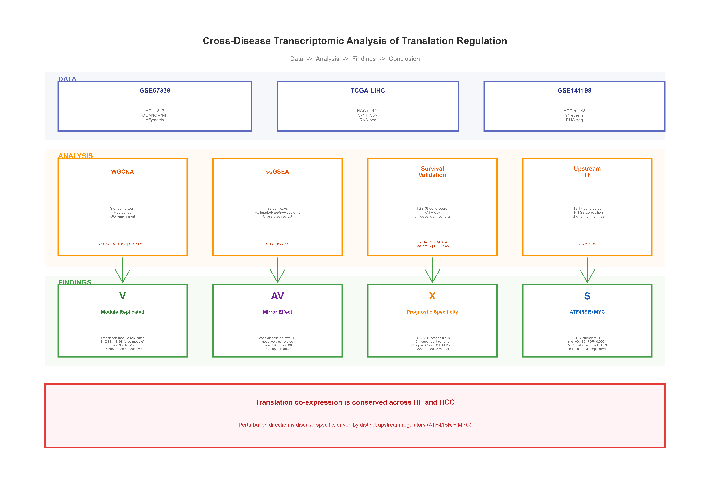

**Fig. 1. Study design overview.** The analytical framework comprises five layers: (A) WGCNA-based identification of translation-related co-expression modules in HF myocardium (GSE57338, n = 313) with systematic annotation-based module scoring; (B) independent WGCNA in HCC (GSE141198, n = 148); (C) parallel ssGSEA pathway activity scoring across both diseases with quantitative cross-disease effect-size comparison; (D) exploratory evaluation of the translation-associated transcriptional score (TATS) in three HCC cohorts; (E) systematic screening for upstream transcriptional regulators. The framework tests whether translation-related programs exhibit shared network organization or disease-context-dependent remodeling, and whether perturbation direction is disease-specific.

---

## 2. Materials and methods

### 2.1. Data acquisition and preprocessing

Datasets were selected based on the following criteria: (i) availability of both disease and non-disease control samples within the same study; (ii) sample size ≥ 100; and (iii) raw or normalized expression matrices publicly available.

**GSE57338 (HF).** Downloaded from GEO, n = 313 left ventricular samples (dilated cardiomyopathy, ischemic cardiomyopathy, non-failing controls), platform GPL11532 (Affymetrix HuGene 1.1 ST Array). Probes were first filtered to retain those with expression above background signal threshold (log2 intensity ≥ 4) in at least 20% of samples, and the remaining probes were then mapped to gene symbols via the hugene11sttranscriptcluster.db annotation package, with multi-probe averaging per gene.

**TCGA-LIHC (HCC discovery set).** Downloaded from the TCGA GDC portal, n = 424 samples (371 tumor + 50 normal + 3 recurrent tumor), RNA-seq (Illumina), using `assay(se, "unstranded")` for counts. Three recurrent tumor samples were excluded from differential expression and pathway analyses because they were not classified as primary tumor or normal liver tissue; all downstream analyses therefore used n = 421 (371 tumor vs. 50 normal). DESeq2 variance stabilizing transformation (VST) normalization was applied using the vst function [13] with `blind = TRUE` and `nsub = 1000` (design = ~ 1), following filtering for genes with counts ≥ 10 in at least 20% of samples. Ensembl IDs were converted to gene symbols via org.Hs.eg.db.

**GSE141198 (HCC validation set).** Downloaded from GEO, n = 148 HCC tumors (RNA-seq), 94 OS events. Processing pipeline identical to TCGA-LIHC.

**GSE14520 and GSE76427 (external validation).** GSE14520 (n = 221 HCC tumors, GPL3921 Affymetrix HT Human Genome U133A Array) and GSE76427 (n = 115 HCC tumors, GPL10558 Illumina HumanHT-12 V4.0) were downloaded from GEO for external TATS validation. Processing and TATS calculation were performed identically across all validation cohorts.

### 2.2. WGCNA co-expression network analysis

WGCNA input data consisted of gene expression matrices filtered and normalized as described in Section 2.1. For GSE57338 (microarray data), the bottom 20% of genes by variance were removed, and the top 6,000 most variable genes were retained for network construction (retaining 177 of 214 ribosomal/translation-related genes in the full expression matrix). For GSE141198 (RNA-seq data), all expressed genes passing the Section 2.1 filters (5,003 genes) were used. Signed network analysis was performed using the WGCNA package [14,15]. The soft threshold β was selected to best approximate the scale-free topology criterion (R² ≈ 0.85; GSE57338: β = 17, signed R² = 0.865; GSE141198: β = 4, R² = 0.84; Supplementary Fig. S4). Network construction parameters — including soft-threshold power, gene filtering strategy, and module detection method — were independently optimized for each dataset according to platform-specific data characteristics, rather than forced to be identical across diseases.

For GSE57338, a manual stepwise procedure was used: Pearson correlation (stats::cor) → signed adjacency matrix [(0.5 × (1 + cor))^β] → TOM similarity (WGCNA::TOMsimilarity, TOMType = "signed") → hierarchical clustering (hclust, method = "average") → dynamic tree cutting (dynamicTreeCut::cutreeDynamic, deepSplit = 2, minClusterSize = 30). This manual procedure was adopted to ensure platform compatibility across R versions. For GSE141198, the blockwiseModules one-step function was used for network construction (networkType = "signed", minModuleSize = 30, mergeCutHeight = 0.25, TOMType = "signed", pamRespectsDendro = FALSE, maxBlockSize = 6,000, randomSeed = 42).

**Translation-related module identification.** Rather than designating a translation-related module by manual inspection or prior assumption, an objective translation-enrichment scoring procedure was applied. For each module, GO Biological Process enrichment was performed using clusterProfiler [16] (enrichGO, ont = "BP", pAdjustMethod = "BH", qvalueCutoff = 0.1). A module-level translation score was computed as: (number of significantly enriched GO terms matching translation-related keywords ["translation|ribosom|peptide|ribonucleoprotein|rRNA|translational"]) × (−log₁₀ of the best p.adjust among those terms). The module with the highest translation-enrichment score was designated the translation-related module. In this study, "translation-related transcriptional programs" refer to coordinated expression patterns of genes involved in ribosome biogenesis, translation machinery, and associated regulatory processes, rather than direct measurements of protein synthesis activity. For GSE141198, the blue module (1,315 genes, "cytoplasmic translation" adjusted p = 6.3 × 10⁻¹²) was identified as the translation-related module using the same keyword-based functional annotation approach.

**Hub gene identification.** Hub genes within the translation-related module were identified post hoc using the dual criteria of intramodular connectivity (|Module Membership| > 0.80) and gene significance for the disease phenotype (|Gene Significance| > 0.20). Hub genes were ranked by the product |GS| × |MM|. No genes were pre-specified or excluded based on prior literature.

**Module internal robustness assessment.** To verify that the green module represents a genuine internally robust co-expression structure rather than an artifact of the β = 17 soft-threshold parameter or top-6,000 gene filtering, intra-modular connectivity was assessed via the topological overlap matrix (TOM). Mean intra-modular TOM for the green module (227 genes) was compared against a null distribution generated from 10,000 random gene sets of equal size, yielding a Z-score and empirical p-value. Module stability was further evaluated by gene-level jackknife resampling (90% retention per iteration, 100 iterations) to assess the coefficient of variation (CV) of intra-modular connectivity. Cross-disease coherence was assessed by computing the mean absolute pairwise Pearson correlation of green module genes in the independent GSE141198 expression matrix and comparing this against 1,000 random gene sets of equal size.

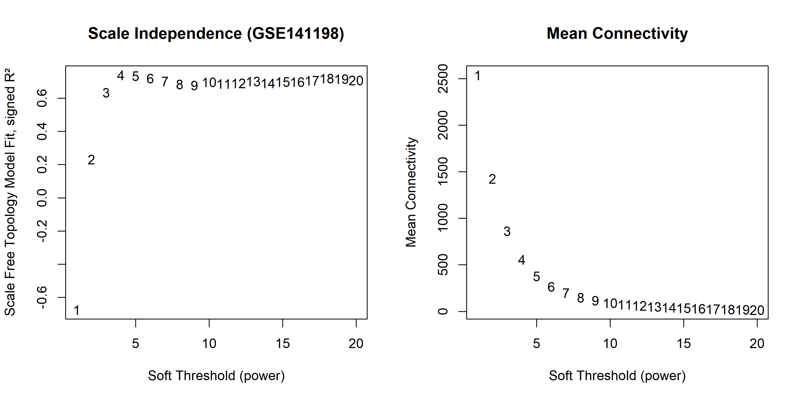
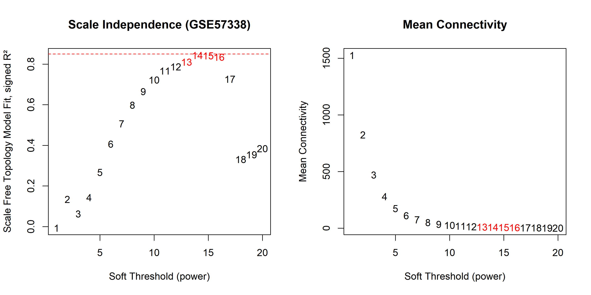

**Fig. S4. Soft threshold selection for WGCNA.** Scale-free topology model fit (R², left panels) and mean connectivity (right panels) as a function of soft threshold power (β). (A) GSE141198 (HCC): β = 4, signed R² = 0.84. (B) GSE57338 (HF): β = 17, signed R² = 0.865. The R² ≈ 0.85 criterion (dashed red line) was used for threshold selection.

### 2.3. ssGSEA pathway activity analysis

Gene set sources: msigdbr package (v26.1.0), including all 50 Hallmark gene sets (collection = "H"), KEGG ribosome (collection = "C2", subcollection = "CP:KEGG_MEDICUS", 1 set), and Reactome translation-related pathways (collection = "C2", subcollection = "CP:REACTOME", keyword-filtered: TRANSLATION|PEPTIDE_CHAIN_ELONGATION|EUKARYOTIC_TRANSLATION|RIBOSOME|NONSENSE_MEDIATED|TRNA_AMINOACYLATION|RRNA_PROCESSING, 32 sets), yielding 83 input gene sets. During ssGSEA scoring, the minSize = 5 parameter (requiring ≥ 5 genes from a given gene set to be present in the expression matrix) filtered two Hallmark sets with insufficient gene coverage, resulting in 81 pathways retained for cross-disease comparison.

ssGSEA scoring was performed using the GSVA package (v2.6.2): parameter objects were constructed via ssgseaParam (minSize = 5, maxSize = 500), and single-sample pathway activity scores were computed using the gsva function from the GSVA package [17], which implements the ssGSEA algorithm originally described by Barbie et al. [18] Disease effect size for each pathway was calculated as Cohen's d. Cross-disease Spearman correlation of pathway effect sizes was evaluated. Statistical significance of the cross-disease correlation was assessed by a 10,000-iteration permutation test (random seed = 42), where the vector of HF pathway effect sizes was randomly shuffled in each iteration.

### 2.4. Translation-associated transcriptional score (TATS) and survival analysis

The translation-associated transcriptional score (TATS) was defined as the mean of z-scores of VST-normalized expression values for the green module genes (n = 227) identified in the HF WGCNA. TATS was evaluated as an exploratory measure of translation-related transcriptional activity rather than as a validated prognostic signature. For GSE141198, OS time and status were obtained from the "os days:ch1" and "os status:ch1" fields, respectively. For GSE14520 and GSE76427, OS definitions followed the respective GEO record annotations. Patients were dichotomized into high/low groups by median TATS. Kaplan–Meier survival curves were compared using the log-rank test. Cox proportional hazards regression was performed using the survival package, with TATS modeled as both a continuous variable (per-IQR increase) and a binary variable (median split). Multivariate Cox models were adjusted for etiology (HBV, HCV, NBNC) in cohort-specific subgroup analyses where etiology data were available. The proportional hazards assumption was assessed using Schoenfeld residual tests.

### 2.5. Upstream transcription factor analysis

Nineteen candidate TFs were selected based on literature and MSigDB: ATF4, DDIT3, E2F1, E2F2, E2F3, E2F4, E2F5, E2F6, E2F7, E2F8, HIF1A, MTOR, MYC, MYCL, MYCN, NFE2L2, RPTOR, TP53, XBP1. This list encompasses the MYC family (MYC, MYCN, MYCL), the E2F family (E2F1–E2F8), mTOR pathway components, and stress-responsive TFs (ATF4, DDIT3, XBP1, HIF1A, NFE2L2, TP53).

Spearman correlation coefficients were computed between VST-normalized expression values of each TF and TATS across GSE141198 tumor samples (n = 148). Benjamini–Hochberg (BH) false discovery rate (FDR) correction was applied across all 19 tests.

### 2.6. Direction consistency testing

Cross-disease log2 fold-change (log2FC) values for translation-related module genes were obtained from TCGA-LIHC (tumor vs. normal, DESeq2) and GSE57338 (HF vs. non-failing, limma). Spearman correlation of cross-disease log2FC was used to assess directional consistency. Significance was evaluated by a 10,000-iteration permutation test (random seed = 42): the HCC-side log2FC vector was randomly shuffled in each iteration, and the one-sided empirical p-value was computed as the proportion of permuted Spearman ρ values exceeding the observed ρ.

### 2.7. Statistical analysis

All analyses were conducted in R version 4.6.0 (2026-04-24 ucrt). The following R packages were used: WGCNA (v1.74), DESeq2 (v1.52.0), GSVA (v2.6.2), msigdbr (v26.1.0), clusterProfiler (v4.20.0), survival (v3.8-6), survminer (v0.5.2), limma (v3.68.4), org.Hs.eg.db (v3.23.1), hugene11sttranscriptcluster.db (v8.8.0), TCGAbiolinks (v2.40.0), and dynamicTreeCut (v1.63-1). A complete session information record is available in the GitHub repository. The statistical significance threshold was set at two-sided p < 0.05 unless otherwise stated. The BH FDR correction was applied for multiple testing correction throughout (GO enrichment, TF–TATS correlations). Permutation tests used 10,000 iterations with a fixed random seed (set.seed(42)) to ensure reproducibility. Missing data were not imputed (missing rate < 5% in all datasets).

### 2.8. Robustness assessment across independent heart failure cohorts

To assess the cross-cohort robustness of the mirror perturbation, an independent HF cohort (GSE116250; n = 64: 14 non-failing donors, 37 dilated cardiomyopathy, 13 ischemic cardiomyopathy) was analyzed using the identical ssGSEA pipeline (Section 2.3). RNA-seq RPKM values were log2-transformed, and Cohen's d effect sizes were computed for the 33 translation-related pathways (DCM + ICM vs. NF). Cross-disease effect size correlation (Spearman ρ) and sign concordance (mirror pathway overlap) between GSE116250 and TCGA-LIHC were compared with the original GSE57338–TCGA-LIHC comparison.

### 2.9. Same-organ disease controls

To distinguish disease-specific mirror perturbation from constitutive tissue-specific differences, two same-organ disease comparisons were performed: (i) hypertrophic cardiomyopathy (HCM) vs. non-failing myocardium (GSE141910; n = 28 HCM, n = 166 NF), as a cardiac disease comparison; and (ii) cirrhosis vs. normal liver (GSE89377; n = 12 cirrhosis, n = 13 normal), as a liver disease comparison. The identical ssGSEA pipeline (Section 2.3) was applied, and cross-disease effect size correlations with TCGA-LIHC were computed for each. A null or non-negative correlation in same-organ comparisons, contrasted with the negative correlation in the HF–HCC comparison, would support disease-context specificity rather than tissue-baseline confounding.

### 2.10. Data and code availability

All datasets used in this study are publicly available: GSE57338, GSE141198, GSE14520, and GSE76427 from GEO (https://www.ncbi.nlm.nih.gov/geo/); TCGA-LIHC from the GDC Data Portal (https://portal.gdc.cancer.gov/). All datasets are accessible via their public landing pages. Analysis code has been deposited in a GitHub repository (https://github.com/zxy048/translation-mirror-hf-hcc), containing the complete WGCNA, ssGSEA, TF prediction, and direction consistency analysis pipelines, accessible via an anonymous link during peer review.

---

## 3. Results

### 3.1. Disease-specific network remodeling identifies translation-related transcriptional programs in heart failure and hepatocellular carcinoma

To identify translation-related co-expression modules without imposing prior gene selection constraints, we performed signed WGCNA on HF left ventricular myocardium (GSE57338, n = 313; dilated cardiomyopathy, ischemic cardiomyopathy, and non-failing controls) using an expanded gene set (top 6,000 genes by variance, retaining 177 of 214 ribosomal/translation-related genes in the full expression matrix; β = 17, scale-free R² = 0.865; Supplementary Fig. S4B). Eleven co-expression modules were identified. Module functional annotation was performed via GO Biological Process enrichment (clusterProfiler), and the translation-related module was objectively identified by a composite translation-enrichment score integrating GO term count and significance (see Methods 2.2), rather than by manual designation.

The **green module** (227 genes) was identified as a module enriched for translation-related biological processes (translation-enrichment score = 695.1). GO enrichment confirmed highly significant association with ribosome biogenesis (adjusted p = 2.3 × 10⁻¹³; fold enrichment = 9.6), ribosomal small subunit biogenesis (adjusted p = 4.5 × 10⁻⁸; fold enrichment = 11.7), rRNA processing (adjusted p = 2.2 × 10⁻⁶), rRNA metabolic process (adjusted p = 4.8 × 10⁻⁶), and ribosomal large subunit biogenesis (adjusted p = 2.2 × 10⁻⁴; fold enrichment = 11.2) (Supplementary Table S5). The green module eigengene showed a significant negative correlation with HF status (**r = −0.521, p = 3.6 × 10⁻²³**), indicating that this translation-related transcriptional program is downregulated in the failing myocardium. Among the 11 modules identified, the strongest correlation with HF was observed in the grey module (r = −0.755, 1,336 unassigned genes), followed by yellow (r = +0.682, 306 genes) and green (r = −0.521). The ribosomal/translation-related genes were distributed across multiple modules (turquoise: 21, green: 17, grey: 9, black: 5, blue: 2, magenta: 1, pink: 1 of 56 retained), indicating that translational machinery genes participate in several distinct co-expression contexts rather than concentrating in a single module.

Hub genes were defined post hoc using dual criteria of |Gene Significance| > 0.2 and |Module Membership| > 0.8 within the green module (Fig. S1) — the same criteria applied previously, now directed at the data-driven translation-related module. The top ten hub genes ranked by the product of |GS| × |MM| are listed in Table S1. These hub genes are positioned within the translation-related transcriptional network rather than representing canonical components of the ribosome machinery; they include transcriptional regulators and RNA-processing factors that may participate in coordinating ribosome biogenesis gene expression. None of the seven previously reported canonical hub genes (EEF1A1, FAU, RPL39, RPL3, RPL32, RPL41, RPS28) met the dual criteria in the green module: four (FAU, RPL39, RPL32, RPS28) were assigned to the black module, one (RPL3) to blue, and two (EEF1A1, RPL41) were not present in the top-6,000 input gene set. The previously identified hub gene set therefore does not represent the translation-related co-expression module identified through systematic annotation-based analysis.

To determine whether a translation-related module also exists in HCC, we examined the independently constructed HCC WGCNA (GSE141198, n = 148; β = 4, R² = 0.84). The GSE141198 blue module (1,315 genes) showed "cytoplasmic translation" as the most significantly enriched GO term (adjusted p = 6.3 × 10⁻¹²), consistent with the presence of a translation-related transcriptional program in HCC. However, the network topology differed substantially: the HF translation-related program was concentrated in a compact module (green, 227 genes, enriched for ribosome biogenesis), whereas the corresponding HCC program was distributed across a larger module (blue, 1,315 genes, enriched for cytoplasmic translation). Cross-disease module gene overlap was limited: 62 of 227 HF green module genes were present in the HCC WGCNA input (the top-variability-filtered matrix used for network construction), and their distribution across HCC modules (turquoise: 28, blue: 23, grey: 11) showed only modest enrichment for the HCC blue module (Fisher's exact test, OR = 1.7, p = 0.039). Importantly, the translation-associated transcriptional score (TATS; Section 2.4) was calculated from the complete unfiltered normalized expression matrix, not the WGCNA input matrix; all green module genes detected in the full expression matrix contributed to the score, regardless of whether they met the variability threshold for network construction. This limited gene-level overlap suggests that translation-related programs may involve disease-context-dependent network organization at the gene-module level rather than a universally conserved co-expression module.

Taken together, both HF and HCC contain translation-related transcriptional programs identifiable through systematic WGCNA-based module discovery, but their gene-module organization patterns — including module size, gene composition, and hub gene identity — differed under dataset-specific network construction settings. These findings are consistent with a model of disease-context-dependent network organization (Fig. 2), rather than cross-disease conservation of a single translational co-expression module. Differences in module size and topology should therefore not be interpreted as direct quantitative comparisons of network complexity, but rather as context-dependent representations of disease-associated co-expression organization. Module internal robustness analysis confirmed that the green module represents a genuine co-expression structure (intra-modular TOM Z = 62.8, permutation p < 0.0001; jackknife CV = 1.6%; Supplementary Fig. S7), rather than an artifact of the β = 17 soft-threshold parameter. We next examined whether this disease-context-dependent network organization is accompanied by opposite-direction perturbation at the pathway level.

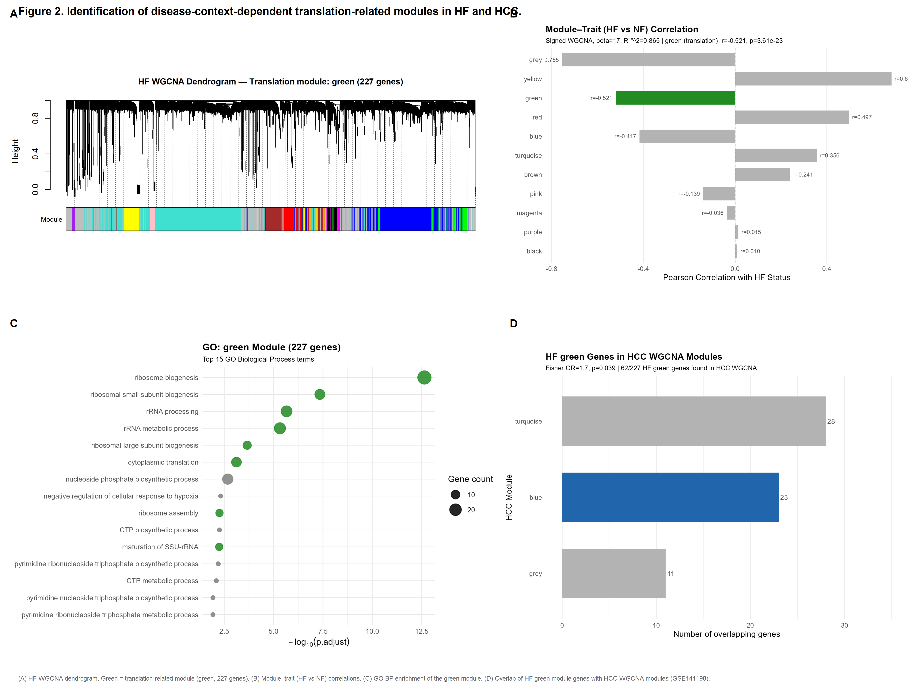

**Fig. 2. Identification of disease-context-dependent translation-related modules in HF and HCC.** (A) Gene dendrogram and module assignment from signed WGCNA of GSE57338 (HF, n = 313). The green module (227 genes) was identified as the translation-related module via GO-based scoring (β = 17, signed R² = 0.865). (B) Module–trait (HF vs. non-failing) correlation coefficients. Green module: r = −0.521 (p = 3.6 × 10⁻²³), indicating translational downregulation in HF. (C) GO Biological Process enrichment of the green module. Top terms include ribosome biogenesis (adjusted p = 2.3 × 10⁻¹³) and rRNA processing. (D) Cross-disease module gene overlap: distribution of HF green module genes across HCC WGCNA modules (GSE141198). Limited gene-level overlap (62 of 227 genes found; Fisher OR = 1.7, p = 0.039), indicating disease-specific network organization rather than module conservation.

### 3.2. Opposite pathway-level perturbation of translation-related programs between HF and HCC

The network analysis (Section 3.1) revealed that HF and HCC each contain translation-related transcriptional programs, but organized through disease-specific co-expression architectures with limited gene-level overlap. We next asked whether, despite this network-level divergence, the two diseases exhibit convergent perturbation at the pathway level. To address this, we performed ssGSEA pathway activity scoring in parallel across 81 pathways (48 Hallmark + 1 KEGG ribosome + 32 Reactome translation-related pathways) in TCGA-LIHC (371 tumor vs. 50 normal) and GSE57338 (HF vs. non-failing), and computed Cohen's d effect sizes for each pathway.

The Spearman correlation of effect sizes across all 81 pathways between the two diseases was ρ = −0.290 (p = 0.0089), reflecting an overall moderate-to-weak negative correlation. However, when the analysis was restricted to the 33 translation/ribosome-related pathways, the negative correlation in effect sizes increased to **ρ = −0.598 (p = 0.0003; bootstrap 95% CI [−0.756, −0.340])**. A 10,000-iteration permutation test supported this result (permutation p = 0.0079; Fig. 3). The specific composition of the 33 translation pathways and complete effect size data for all 81 pathways are provided in Supplementary Table S2.

Detailed examination of translation pathway effect sizes showed a consistent pattern: all 33 translation pathways showed positive effect sizes in HCC (Cohen's d > 0, higher expression in tumor vs. normal tissue), whereas the vast majority showed negative effect sizes in HF (d < 0, lower expression in failing vs. non-failing myocardium). Among the 33 translation pathways, 24 exhibited an HCC-positive/HF-negative paired pattern, representing a predominant mirror perturbation (binomial test p < 0.0001; Supplementary Table S4). The remaining nine pathways were enriched for mitochondrial translation or miRNA-mediated translational regulation rather than core cytoplasmic translation (Supplementary Table S2). Proliferation-associated pathways (E2F Targets, G2M Checkpoint, and MYC Targets V1) exhibited the largest positive effect sizes in HCC (Cohen's d = +1.83 to +2.35). The most upregulated pathways in HF were Bile Acid Metabolism (d = +0.79) and Interferon Alpha Response (d = +0.67); their absolute effect sizes were considerably smaller than those of proliferation pathways in HCC.

This pathway-level mirror perturbation — with 24 of 33 translation pathways coordinately upregulated in HCC and downregulated in HF — constitutes the strongest quantitative signal in this study (ρ = −0.598, permutation p = 0.0079). Importantly, this signal emerges at the pathway level despite the substantial network-level divergence between the two diseases' translation-related modules (Section 3.1). The contrast between distinct network organization and convergent pathway-level perturbation illustrates a key analytical principle: co-expression network topology captures disease-specific regulatory configurations, whereas aggregated pathway activity identifies shared functional themes that transcend these configurational differences. This distinction — network-level differences with pathway-level convergence — is a central finding of this study and informs the interpretation of all subsequent analyses.

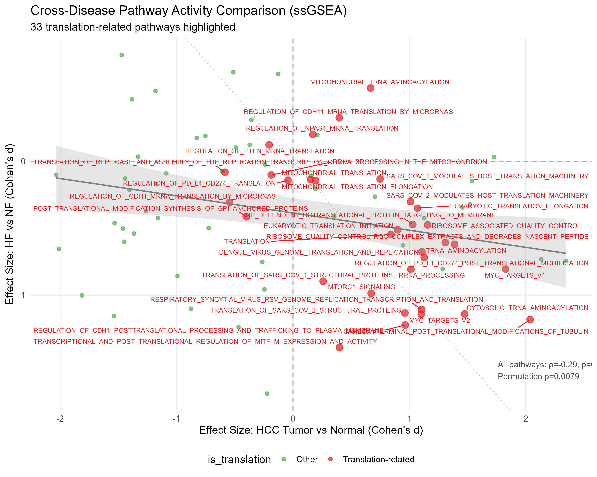

**Fig. 3. Cross-disease pathway-level mirror perturbation between HF and HCC.** Scatter plot of Cohen's d effect sizes for 81 pathways in HCC (TCGA-LIHC, tumor vs. normal, x-axis) versus HF (GSE57338, failing vs. non-failing, y-axis). Translation/ribosome-related pathways (n = 33) are shown as red points; non-translation pathways (n = 48) as gray points. For translation pathways, Spearman ρ = −0.598 (p = 0.0003; permutation test with 10,000 iterations, p = 0.0079). Dashed lines mark d = 0; the dotted diagonal (y = −x) represents perfect mirror symmetry. 24 of 33 translation pathways fall in Quadrant IV (HCC↑ HF↓), representing the predominant mirror perturbation pattern (binomial test p < 0.0001). This pathway-level convergence occurs despite distinct co-expression network organization (Fig. 2), indicating that shared functional themes can emerge from disease-specific regulatory architectures.

#### 3.2.1. Disease and cohort context influence the magnitude of translation-related remodeling

The mirror perturbation observed in the GSE57338–TCGA-LIHC comparison (24/33 mirror pathways, ρ = −0.598) raises the question of whether this pattern consistently replicates across independent cohorts — and, if not, what the sources of variability reveal about the underlying biology. To assess cross-cohort generalizability, the identical ssGSEA pipeline was applied to an independent HF cohort (GSE116250; 14 NF, 37 DCM, 13 ICM; RNA-seq).

The all-pathway Spearman correlation between GSE116250 HF effect sizes and TCGA-LIHC HCC effect sizes remained negative (ρ = −0.283, p = 0.011), preserving the overall cross-disease trend. However, the translation-pathway subset did not reproduce the magnitude of mirror perturbation observed in GSE57338 (ρ = +0.249, p = 0.162; 14/33 mirror pathways vs. 24/33 in GSE57338). This discrepancy may reflect several contributing factors: (i) **Disease etiology and severity** — GSE57338 comprises advanced HF patients requiring transplantation (DCM/ICM) with severe energetic failure, whereas GSE116250 includes a broader disease spectrum with differing severity distribution; transplant-stage HF may produce a more pronounced translational suppression signal; (ii) **Platform** — microarray (GSE57338) vs. RNA-seq RPKM (GSE116250) may differentially affect pathway-level signal resolution; and (iii) **Statistical power** — the smaller sample size (n = 64 vs. n = 313) reduces precision for translation-subset comparisons. These factors collectively suggest that the mirror perturbation may represent a disease-state-dependent transition whose magnitude varies with cohort characteristics, rather than a binary (present/absent) feature uniformly detectable across all HF populations. This context-dependent variability in the strength of translation-related remodeling is consistent with the disease-context-dependent framework described in Section 3.1.

The observed cross-cohort heterogeneity raised the question of whether the mirror perturbation could instead reflect constitutive transcriptional differences between cardiac and hepatic tissue, independent of the specific disease context. To distinguish disease-specific mirror perturbation from tissue-specific baseline characteristics, two same-organ disease comparisons were performed (Supplementary Fig. S5). In the cardiac same-organ comparison (GSE141910; HCM vs. non-failing myocardium), translation pathway effect sizes showed no correlation with HCC (ρ = −0.036, p = 0.840; 14/33 mirror pathways), consistent with a null distribution. The absence of mirror perturbation in hypertrophic cardiomyopathy argues against a generic cardiac disease effect, indicating that the cross-disease HF–HCC mirror perturbation cannot be attributed to constitutive cardiac tissue-specific transcriptional programs. In the liver same-organ comparison (GSE89377; cirrhosis vs. normal liver), translation pathway effect sizes were positively correlated with HCC (ρ = +0.402, p = 0.021; 9/33 mirror pathways), consistent with the progressive translational activation that accompanies hepatocarcinogenesis. Together, these same-organ disease controls indicate that the mirror perturbation emerges within specific disease contexts rather than reflecting organ-level baseline differences. Collectively, these analyses indicate that the observed mirror perturbation is context-dependent, reproducible at the level of global pathway organization, and absent in same-organ disease comparisons.

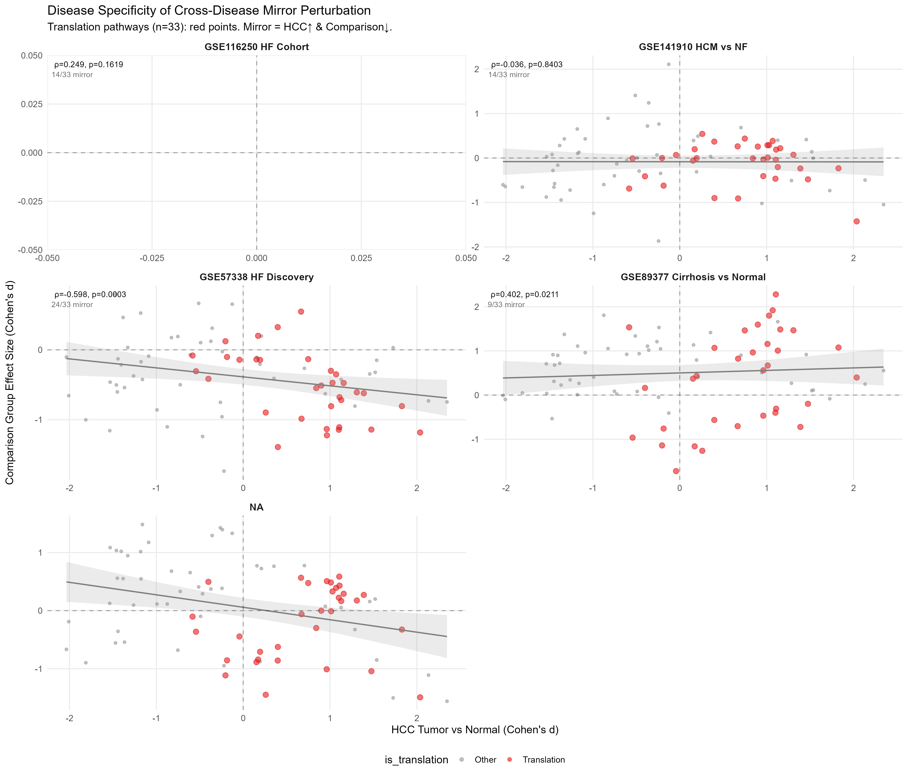

**Fig. S5. Cohort dependency and disease-context analyses of cross-disease mirror perturbation.** Cross-disease Spearman correlation of pathway-level Cohen's d effect sizes (x-axis: HCC, TCGA-LIHC) for 33 translation-related pathways (red) and 48 other pathways (gray). (A) HF discovery cohort (GSE57338): ρ = −0.598, 24/33 mirror. (B) Cardiac same-organ control (GSE141910, HCM vs. NF): ρ = −0.036 (p = 0.84) — no mirror perturbation, excluding a generic cardiac disease effect. (C) Liver same-organ control (GSE89377, cirrhosis vs. normal): ρ = +0.402 (p = 0.021) — translation pathways positively correlated with HCC, consistent with pre-malignant translational activation. (D) Independent HF cohort (GSE116250): overall cross-disease trend retained (all-pathway ρ = −0.283, p = 0.011); translation-subset shows cohort-dependent heterogeneity (ρ = +0.249, 14/33 mirror), indicating that the magnitude of mirror perturbation varies with disease etiology, severity, and platform. Mirror perturbation was absent in both same-organ comparisons, supporting disease-context specificity.

### 3.3. Exploratory assessment of TATS clinical associations

Given that translation-related programs may reflect biological states rather than disease-specific prognostic determinants, we explored whether a translation-associated transcriptional score (TATS) — defined as the mean normalized expression of the 227 green module genes — showed clinical associations in independent HCC cohorts as an exploratory analysis. TATS was evaluated in HCC rather than HF because available HCC cohorts provide standardized survival annotation, whereas GSE57338 represents a cross-sectional transplant population without comparable long-term outcome data.

TATS did not significantly stratify patients by overall survival in GSE141198 (n = 148, 94 events; Log-rank p = 0.303; Fig. S6A). When analyzed as a continuous variable, TATS was also non-significant in Cox regression (HR = 1.68, 95% CI [0.67, 4.21], p = 0.265). Stratification by etiology (HBV, HCV, NBNC) revealed no significant prognostic value for TATS in any subgroup. Across all three independent HCC cohorts — GSE141198, GSE14520 (n = 221), and GSE76427 (n = 115) — TATS showed no significant prognostic association. The limited prognostic value of TATS indicates that translation-related module activity, as measured by aggregate gene expression, does not function as a universal clinical biomarker in HCC. This finding is consistent with the disease-context-dependent interpretation: the transcriptional organization of translation-related genes differs between HF and HCC (Section 3.1), and their aggregate expression level in tumor tissue may not capture the clinically relevant dimension of translational dysregulation.

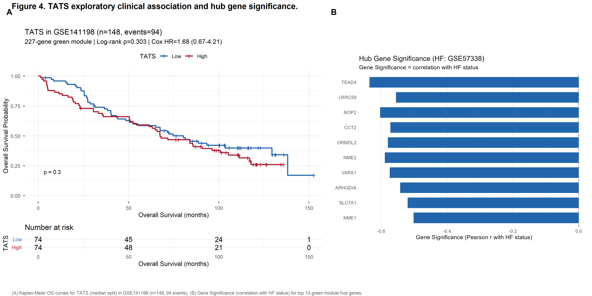

**Fig. S6. TATS exploratory clinical association and hub gene significance.** (A) Kaplan–Meier overall survival curves for TATS (median split) in the GSE141198 HCC cohort (n = 148, 94 events). Log-rank p = 0.303; Cox HR = 1.68, 95% CI [0.67, 4.21], p = 0.265. TATS does not significantly stratify patients by overall survival. (B) Gene Significance (Pearson correlation with HF status) for the top 10 green module hub genes in GSE57338. All hub genes show negative Gene Significance, consistent with translational downregulation in HF. HR, hazard ratio; CI, confidence interval.

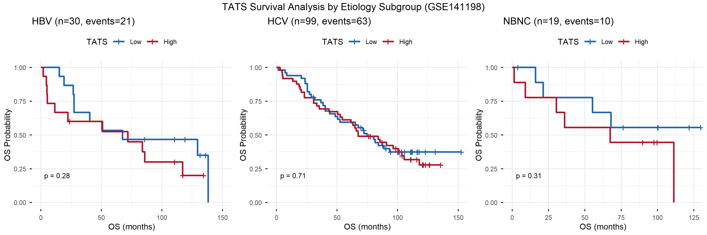

**Fig. S2. TATS exploratory survival analysis in GSE141198 by etiology subgroup.** Kaplan–Meier survival curves stratified by HBV, HCV, and NBNC etiology. TATS (median split) shows no significant prognostic value in any subgroup, consistent with the overall cohort analysis.

### 3.4. Regulatory associations with translation-related transcriptional programs

Given that translation-related programs exhibit disease-specific network organization (Section 3.1) and pathway-level mirror perturbation (Section 3.2) but limited clinical prognostic value (Section 3.3), we next investigated which transcriptional programs are associated with translation-related transcriptional activity. To address this, we performed systematic transcription factor (TF)–TATS correlation analysis across GSE141198 tumor samples (n = 148). Nineteen candidate TFs were selected, encompassing stress response-related TFs (ATF4, DDIT3, XBP1, HIF1A, NFE2L2, TP53), cell-cycle regulators (E2F family, E2F1–E2F8), and growth/proliferation regulators (MYC, MYCN, MYCL, MTOR, RPTOR).

At the pathway activity level, **MYC target pathway activity showed the strongest overall association with TATS** (MYC Targets V2: ρ = +0.753, p < 0.0001; MYC Targets V1: ρ = +0.459, p < 0.0001; Fig. 4B), substantially exceeding the correlation of MYC mRNA level alone (ρ = +0.255). This discrepancy between TF mRNA level and target pathway activity likely reflects post-translational regulation of MYC activity and the statistical advantage of aggregating multiple target genes into a pathway score. To evaluate whether the MYC Targets V2–TATS association was driven by shared gene representation rather than pathway-level concordance, we quantified the gene overlap between the TATS constituent genes (227 green module genes) and each Hallmark pathway gene set (Supplementary Table S7). MYC Targets V2 showed 9 overlapping genes (4.0% of TATS; Jaccard index = 0.033), MYC Targets V1 showed 12 (5.3%), and E2F Targets showed 4 (1.8%) (Supplementary Table S7). De-overlap sensitivity analysis — removing the 9 shared genes from TATS and recomputing all TF–TATS correlations — confirmed that the association structure was essentially unchanged: ATF4–TATS ρ = 0.499 (vs. 0.500 original), MYC mRNA–TATS ρ = 0.223 (vs. 0.255; Supplementary Table S7). Of the 9 overlapping genes between TATS and MYC Targets V2, 8 were present in the GSE141198 expression matrix (1 gene was absent due to platform annotation filtering). TATS-side de-overlap — removing these 8 genes from the TATS gene set, while the ssGSEA-based MYC Targets V2 pathway score (which aggregates over the full Hallmark gene set via the GSVA algorithm) was unchanged — confirmed that the MYC Targets V2–TATS association remained robust (de-overlap ρ = 0.714, bootstrap 95% CI [0.620, 0.786]; original ρ = 0.753, bootstrap 95% CI [0.666, 0.817]), consistent with the conclusion that the strong pathway-level association is not an artifact of shared gene representation. E2F Targets (ρ = +0.409, p < 0.0001) and MTORC1 Signaling (ρ = +0.335, p < 0.0001) pathway activities were also positively associated with TATS, consistent with the proliferative dimension of translation-related transcriptional remodeling.

At the individual TF expression level, eleven of nineteen TFs were significantly correlated with TATS at FDR < 0.05. Among these, **ATF4 showed the strongest association among individual TF transcripts** (ρ = +0.500, FDR < 0.0001; bootstrap 95% CI [0.359, 0.621]; Fig. 4A). ATF4 is the master transcription factor of the integrated stress response (ISR), a conserved signaling cascade that couples cellular stress sensing to translational reprogramming. Additional ISR and unfolded protein response (UPR)-related TFs were also significantly associated with TATS: DDIT3 (CHOP; ρ = +0.338, FDR < 0.0001; bootstrap 95% CI [0.192, 0.475]) and XBP1 (ρ = +0.180, FDR = 0.050), indicating ISR pathway-level co-association rather than isolated ATF4 upregulation. Among the E2F family, multiple members showed positive correlations: E2F1 (ρ = +0.352, FDR < 0.0001), E2F2 (ρ = +0.291, FDR = 0.001), E2F3 (ρ = +0.270, FDR = 0.003), E2F4 (ρ = +0.202, FDR = 0.029), and E2F6 (ρ = +0.191, FDR = 0.038). NFE2L2 was negatively correlated with TATS (ρ = −0.280, FDR = 0.002), while MYCL showed the strongest negative association (ρ = −0.388, FDR < 0.0001). Among the remaining TFs, MYC mRNA showed a significant but modest individual correlation (ρ = +0.255, FDR = 0.004; see also pathway-level MYC activity above), while E2F5 (ρ = +0.101, FDR = 0.318), E2F7 (ρ = −0.001, FDR = 0.988), E2F8 (ρ = +0.098, FDR = 0.318), MYCN (ρ = +0.001, FDR = 0.989), and RPTOR (ρ = +0.166, FDR = 0.069) showed weak or non-significant individual associations. HIF1A (ρ = −0.039, FDR = 0.756), MTOR (ρ = +0.021, FDR = 0.895), and TP53 (ρ = +0.041, FDR = 0.756) showed no significant correlation with TATS in this cohort. Complete TF–TATS correlation statistics for all 19 candidate TFs are provided in Supplementary Table S6.

These results identify two distinct transcriptional dimensions associated with translation-related transcriptional programs in HCC: (i) **proliferative demand** — MYC target pathway activity (ρ = +0.753), reflecting the requirement for ribosome biogenesis and protein synthesis capacity to support uncontrolled proliferation; and (ii) **stress-adaptive signaling** — ATF4/ISR (ρ = +0.500), co-associated with DDIT3 and XBP1, linking cellular stress adaptation to translational reprogramming. These dimensions are complementary rather than competing: MYC pathway activity (ρ = +0.753) and ATF4 expression (ρ = +0.500) represent distinct regulatory layers — proliferative pathway output and stress-responsive transcriptional control, respectively — that may jointly accompany translation-related remodeling in HCC. These associations are correlational and require experimental validation to establish causality.

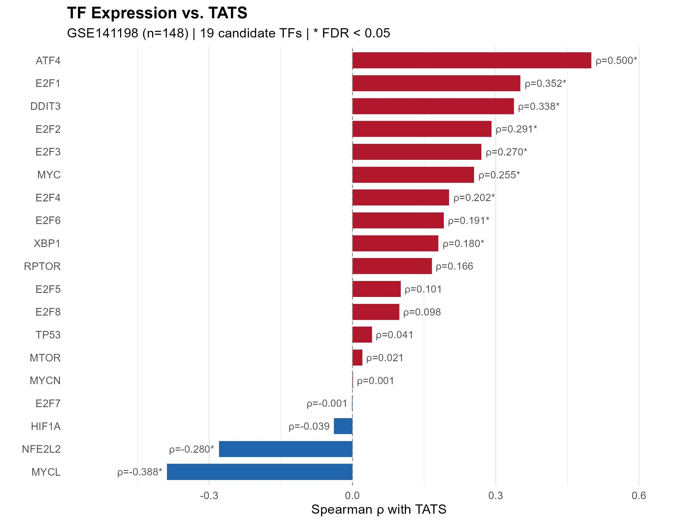
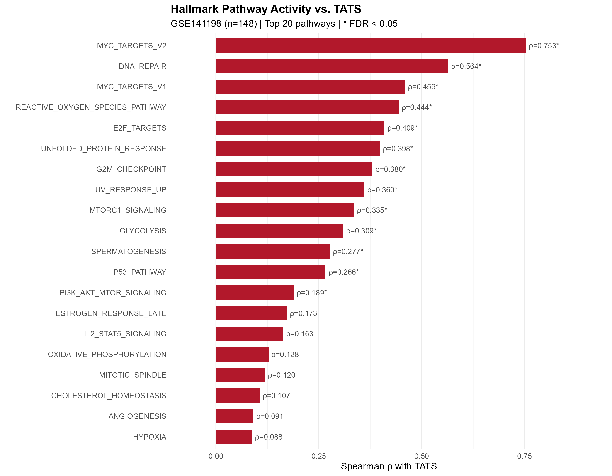

**Fig. 4. Transcription factor and pathway activity associations with TATS in HCC.** (A) Spearman correlation of 19 candidate transcription factors with TATS in GSE141198 tumor samples (n = 148). Red bars: positive correlation (FDR < 0.05); blue bars: negative correlation (FDR < 0.05); gray: not significant. ATF4 is the strongest individual TF correlate (ρ = +0.500, FDR < 0.0001). (B) Spearman correlation of Hallmark pathway ssGSEA scores with TATS. MYC Targets V2 pathway activity shows the strongest overall association (ρ = +0.753, p < 0.0001), exceeding MYC mRNA level alone (ρ = +0.255). ATF4/ISR (stress-adaptive) and MYC (proliferative) represent complementary transcriptional dimensions associated with translation-related transcriptional remodeling.

---

## 4. Discussion

This study investigated whether translation-related transcriptional programs are organized through shared network organization or disease-specific remodeling across heart failure and hepatocellular carcinoma — two diseases with fundamentally opposing translational demands. Three principal findings emerge. First, systematic WGCNA-based module discovery identified translation-related co-expression modules in both diseases (HF green module, 227 genes, ribosome biogenesis; HCC blue module, 1,315 genes, cytoplasmic translation), but their network organization — module size, gene composition, and hub gene identity — differed substantially, with limited gene-level overlap (Fisher OR = 1.7, p = 0.039). Second, despite this network-level divergence, translation pathways exhibited convergent mirror perturbation at the pathway level: 24 of 33 translation-related pathways were coordinately upregulated in HCC and downregulated in HF (Spearman ρ = −0.598, p = 0.0003), representing the strongest quantitative signal in this study. Third, this mirror perturbation was absent in same-organ disease controls (HCM vs. NF, ρ = −0.036; cirrhosis vs. normal, ρ = +0.402), supporting disease-context specificity rather than tissue-baseline confounding, and showed cohort-dependent variability in an independent HF cohort (GSE116250, 14/33 mirror pathways). Collectively, these findings define a pattern of disease-context-dependent remodeling: translation-related transcriptional programs are independently identifiable across diseases but organized through distinct network organization, with shared functional themes emerging at the pathway level and perturbation direction shaped by disease context.

The contrast between distinct network organization (Section 3.1) and convergent pathway-level perturbation (Section 3.2) is the central conceptual finding of this study. Previous cross-disease transcriptomic studies have typically sought either conserved modules or differentially expressed genes; our analysis at multiple resolutions — co-expression network topology, module composition, and aggregated pathway activity — indicates that conservation and divergence coexist at different levels of biological organization. The HF green module (227 genes, ribosome biogenesis) and the HCC blue module (1,315 genes, cytoplasmic translation) share translation-related functional themes at the GO enrichment level, yet their gene composition, hub gene identity, and regulatory architecture are disease-specific. This suggests that distinct regulatory networks may independently converge on similar biological processes according to disease-specific demands, rather than deploying an identical conserved module in opposite directions. The mirror perturbation observed at the pathway level (ρ = −0.598) therefore reflects convergence of functional output — translational suppression in the energy-depleted failing myocardium, translational activation in the proliferative HCC microenvironment — achieved through disease-specific network configurations. We refer to this descriptive pattern as disease-context-dependent remodeling: shared functional themes, disease-specific network organization, and opposite perturbation directions. This framework differs fundamentally from the "conserved module" model and provides a more nuanced lens for cross-disease transcriptomic comparisons.

The same-organ disease controls provide critical context for this interpretation. The absence of mirror perturbation in hypertrophic cardiomyopathy (GSE141910; ρ = −0.036) argues against a generic cardiac disease effect, while the positive correlation in cirrhosis (GSE89377; ρ = +0.402) is consistent with progressive translational activation along the hepatocarcinogenic spectrum. These controls indicate that the HF–HCC mirror perturbation reflects disease-context-specific remodeling rather than constitutive tissue-specific transcriptional programs — a distinction that single-disease analyses cannot resolve.

The translation-focused pathway subset exhibited cohort-dependent heterogeneity: the mirror perturbation was prominent in the discovery cohort (GSE57338, 24/33 mirror pathways, ρ = −0.598) but did not reproduce the same magnitude in an independent HF cohort (GSE116250, 14/33 mirror pathways; translation-subset ρ = +0.249, p = 0.162). This cohort-dependent heterogeneity suggests that the magnitude of translation-related remodeling varies with disease severity, etiology composition, and cohort characteristics. Therefore, the cross-disease mirror pattern should be interpreted as a context-dependent observation rather than a universal feature of HF. Transplant-stage HF (GSE57338) may exhibit more pronounced translational suppression than cohorts spanning a broader disease spectrum (GSE116250). This interpretation is consistent with the energy-depletion model of heart failure: with protein synthesis accounting for a substantial fraction of myocardial ATP consumption [1], translational suppression represents an adaptive response whose magnitude scales with energetic stress [19,20,21]. The smaller effect sizes in HF compared with HCC further suggest that translational downregulation in the failing heart reflects gradual, incomplete adaptation rather than the robust oncogene-driven transcriptional reprogramming characteristic of cancer.

Among the transcription factors and pathways examined, MYC target pathway activity showed the highest overall correlation with the translation-associated transcriptional score (ρ = +0.753), while ATF4 showed the strongest association among individual transcription factors (ρ = +0.500, FDR < 0.0001). MYC target pathway activity (particularly MYC Targets V2, which is enriched for ribosome biogenesis and translation-related genes) likely reflects the proliferative demand for protein synthesis capacity [8,12,22]. The strong MYC–TATS association should be interpreted as pathway-level concordance rather than direct evidence of upstream regulation, as both TATS and MYC target gene sets share representation of translation-related genes. ATF4, the master transcription factor of the integrated stress response (ISR), couples cellular stress sensing to translational reprogramming [23,24,25]; its co-association with DDIT3 (CHOP) and XBP1 — ISR and UPR signaling components — suggests pathway-level engagement rather than isolated ATF4 upregulation. These represent distinct regulatory dimensions — proliferative (MYC) and stress-adaptive (ATF4/ISR) — neither subordinate to the other, both associated with translation-related transcriptional remodeling in HCC. In this cohort, HIF1A and MTOR transcript levels were not significantly correlated with TATS, suggesting that their regulatory relationship with translation-related programs may be indirect or context-dependent rather than reflected at steady-state mRNA levels. These correlational findings nominate MYC and ATF4/ISR as candidate regulatory signals associated with translation-related transcriptional remodeling in HCC; causal validation through ChIP-seq and functional perturbation experiments is required.

The translation-associated transcriptional score (TATS) was not intended as a disease-specific biomarker but as a cross-disease transcriptional representation of a translation-associated program conserved at the pathway level. TATS, defined as the mean normalized expression of the 227 green module genes, showed no significant prognostic value in GSE141198 (Log-rank p = 0.303; Cox HR = 1.68, 95% CI [0.67, 4.21], p = 0.265) or in etiology-stratified subgroups. This is consistent across three independent HCC cohorts. The lack of prognostic association indicates that translation-related module activity, measured as aggregate transcript abundance, does not function as a universal clinical biomarker in HCC. This result is informative: it indicates that cross-disease conservation of functional themes does not imply conserved clinical utility, and that the relationship between translation-related transcription and clinical outcome is context-dependent. The absence of prognostic association also suggests that pathway-level transcriptional remodeling does not necessarily translate into patient-level outcome prediction, underscoring the distinction between molecular pathway activity and clinical prognostic utility. More broadly, the absence of prognostic association further suggests that conserved translation-related programs represent context-dependent biological states rather than universal predictors of malignant progression.

Several limitations should be considered. Because this study is based on transcriptomic datasets, the identified translation-related programs represent transcriptional organization of translation-associated genes rather than direct measurements of translational efficiency or protein synthesis rates; ribosome footprint profiling (Ribo-seq) would substantially strengthen the evidence for altered translational activity [26]. These findings represent disease-associated transcriptional organization inferred from bulk expression data and should not be interpreted as direct evidence of causal network rewiring or dynamic remodeling. Bulk transcriptomes cannot fully separate transcriptional remodeling from changes in cellular composition (e.g., cardiomyocyte loss and fibroblast proliferation in HF, tumor purity variation and stromal infiltration in HCC); cell-type deconvolution was beyond the scope of this analysis and represents an important direction for future studies. The ATF4/ISR regulatory hypothesis is derived from correlational analysis and requires causal validation. Moreover, although mirror perturbation was observed at the pathway level in both HF and HCC discovery cohorts, the extent of pathway-level concordance may vary with cohort characteristics including disease subtype composition, severity distribution, and transcriptomic platform differences, as suggested by partial replication in an independent HF cohort (GSE116250). Platform differences between microarray (GSE57338) and RNA-seq (TCGA-LIHC, GSE141198) datasets, while mitigated by within-dataset effect size computation, may introduce systematic bias. Network construction parameters were independently optimized within each dataset according to WGCNA best practices (scale-free topology criterion, R² ≥ 0.8); cross-dataset comparisons of network topology should therefore be interpreted as reflecting both biological differences and dataset-specific optimization, rather than as comparisons between identically parameterized networks. Formal module preservation analysis (e.g., WGCNA modulePreservation) was not performed owing to well-documented cross-platform interpretability challenges in Zsummary threshold calibration; the gene-level overlap quantification reported here (Fisher OR = 1.7, p = 0.039) provides an empirical assessment of limited module gene sharing. While WGCNA provides a well-established framework for co-expression network discovery, alternative network inference methods may identify additional regulatory relationships. HCC cohorts are composed predominantly of individuals of Asian ancestry, and cross-population generalizability requires further evaluation. The cross-disease comparison, while internally controlled through within-dataset effect sizes, remains observational; prospective multi-omics studies with paired ribosome profiling would be required to establish causal relationships between transcriptional remodeling and translational output.

In conclusion, these findings indicate that translation-related transcriptional programs are independently identifiable in HF and HCC but organized through disease-specific network organization, with convergent functional themes emerging at the pathway level and perturbation direction shaped by disease context. The contrast between network-level divergence and pathway-level convergence — rather than module conservation — defines the relationship between these two diseases. This disease-context-dependent remodeling framework (Fig. 5) provides a foundation for future mechanistic studies investigating how distinct pathological environments reshape translation-related transcriptional programs, and illustrates the value of multi-resolution cross-disease comparative frameworks for identifying regulatory principles inaccessible through single-disease analyses.

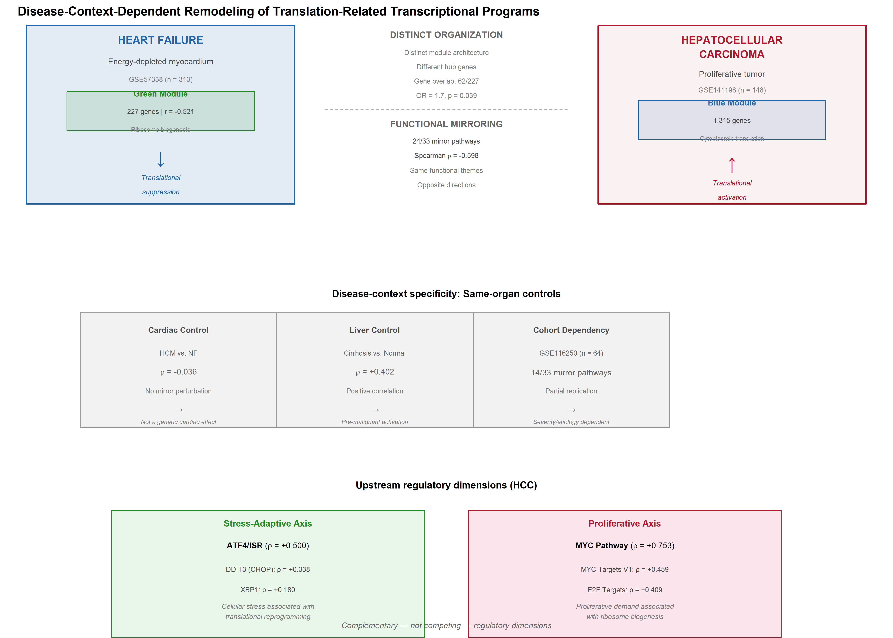

**Fig. 5. Disease-context-dependent remodeling of translation-related transcriptional programs.** Schematic summary of the cross-disease framework. (Top) HF and HCC exhibit distinct co-expression network organization (green module, 227 genes, ribosome biogenesis vs. blue module, 1,315 genes, cytoplasmic translation) with limited gene-level overlap (Fisher's exact test, OR = 1.7, p = 0.039), yet converge on opposite-direction pathway perturbation (24/33 mirror pathways, ρ = −0.598). (Middle) Same-organ disease controls confirm disease-context specificity: HCM vs. NF shows no mirror perturbation (ρ = −0.036), excluding a generic cardiac effect; cirrhosis vs. normal shows positive correlation (ρ = +0.402), consistent with pre-malignant translational activation; an independent HF cohort (GSE116250) shows partial replication (14/33 mirror pathways), indicating severity/etiology-dependent variability. (Bottom) Two complementary candidate regulatory dimensions associated with TATS in HCC: stress-adaptive (ATF4/ISR, ρ = +0.500) and proliferative (MYC pathway, ρ = +0.753).

---

## Supplementary data

Supplementary data to this article can be found online at [DOI to be assigned upon acceptance].

**Supplementary Figures**
- **Fig. S1.** Green module hub gene identification: Module Membership vs. Gene Significance scatter plot for 227 green module genes. Hub genes (|GS| > 0.2 and |MM| > 0.8) are highlighted in green; top 10 hub genes are labeled.
- **Fig. S2.** TATS exploratory survival analysis in GSE141198 by etiology subgroup. Kaplan–Meier curves stratified by HBV, HCV, and NBNC etiology.
- **Fig. S4.** Soft threshold selection for WGCNA. Scale-free topology model fit (R²) and mean connectivity as a function of soft threshold power (β). (A) GSE141198 (HCC): β = 4, signed R² = 0.84. (B) GSE57338 (HF): β = 17, signed R² = 0.865. Dashed red line marks the R² ≈ 0.85 criterion.
- **Fig. S5.** Cohort dependency and disease-context analyses of cross-disease mirror perturbation. Four-panel scatter plot of Cohen's d effect sizes (x-axis: HCC, TCGA-LIHC) for 33 translation pathways (red) vs. 48 other pathways (gray). (A) HF discovery (GSE57338): ρ = −0.598, 24/33 mirror. (B) Cardiac same-organ control (GSE141910, HCM vs. NF): ρ = −0.036 (p = 0.84), no mirror perturbation. (C) Liver same-organ control (GSE89377, cirrhosis vs. normal): ρ = +0.402 (p = 0.021). (D) Independent HF cohort (GSE116250): all-pathway ρ = −0.283 (p = 0.011); translation subset shows cohort-dependent heterogeneity (ρ = +0.249, 14/33 mirror).
- **Fig. S6.** TATS exploratory clinical association and hub gene significance. (A) Kaplan–Meier overall survival curves for TATS (median split) in the GSE141198 HCC cohort (n = 148, 94 events). Log-rank p = 0.303; Cox HR = 1.68, 95% CI [0.67, 4.21], p = 0.265. (B) Gene Significance (Pearson correlation with HF status) for the top 10 green module hub genes in GSE57338.
- **Fig. S7.** Module internal robustness and cross-disease coherence assessment. (A) Permutation histogram: mean intra-modular TOM for 10,000 random gene sets vs. green module (Z = 62.8, p < 0.0001). (B) Intra-modular connectivity by module. (C) Cross-disease gene set coherence: mean absolute pairwise correlation of green module genes in HCC (GSE141198) vs. random gene sets (Z = 2.9, p = 0.008).

**Supplementary Tables**
- **Table S1.** HF green module gene list (227 genes) with Module Membership, Gene Significance, and hub gene annotation.
- **Table S2.** Complete ssGSEA pathway effect sizes (Cohen's d) for 81 pathways across HCC (TCGA-LIHC) and HF (GSE57338), with cross-disease comparison. Includes mirror direction annotation (Yes/No: whether the pathway shows HCC↑/HF↓ pattern) and pathway source (Hallmark/KEGG/Reactome).
- **Table S3.** Cross-disease log2FC and FDR for translation-related module genes in HF (GSE57338) and HCC (TCGA-LIHC).
- **Table S4.** Translation-related pathways showing mirror perturbation (HCC↑/HF↓) with cross-disease Cohen's d effect sizes. Includes pathway name, source database (Hallmark/KEGG/Reactome), HF and HCC effect sizes, and mirror direction annotation for all 33 translation-related pathways.
- **Table S5.** GO Biological Process enrichment with fold enrichment for the HF green module (227 genes). Includes GO ID, description, GeneRatio, BgRatio, fold enrichment, p-value, adjusted p-value, and translation-related annotation for 29 significantly enriched terms.
- **Table S6.** Complete TF–TATS Spearman correlation statistics for all 19 candidate transcription factors in GSE141198 (n = 148 tumors). Includes Spearman ρ, p-value, FDR (Benjamini–Hochberg correction), and significance annotation.
- **Table S7.** Gene overlap analysis between TATS constituent genes (227 green module genes) and Hallmark pathway gene sets (MYC Targets V1/V2, E2F Targets, MTORC1 Signaling, G2M Checkpoint, Unfolded Protein Response, and negative controls). Includes overlap count, percentage, Jaccard index, and hypergeometric test results. Also includes de-overlap sensitivity analysis results (TF–TATS correlations before and after removal of shared genes) and bootstrap 95% confidence intervals for key Spearman correlations.

---

## CRediT authorship contribution statement

**[Author 1]**: Writing – original draft, Visualization, Validation, Software, Methodology, Investigation, Formal analysis, Data curation, Conceptualization.

**[Author 2]**: Methodology, Data curation, Formal analysis, Writing – review & editing.

**[Corresponding Author]**: Writing – review & editing, Validation, Supervision, Project administration, Methodology, Investigation, Formal analysis, Conceptualization.

All authors have read and approved the final version of the manuscript.

## Funding

This research did not receive any specific grant from funding agencies in the public, commercial, or not-for-profit sectors.

## Declaration of competing interest

The authors declare that they have no known competing financial interests or personal relationships that could have appeared to influence the work reported in this paper.

## Acknowledgments

We thank all TCGA, GEO, and MSigDB database researchers and patients involved in the datasets used in this study, for their willingness to share relevant data and their contributions to medical progress.

## Data availability

All datasets used in this study are publicly available: GSE57338, GSE141198, GSE14520, and GSE76427 from GEO (https://www.ncbi.nlm.nih.gov/geo/); TCGA-LIHC from the GDC Data Portal (https://portal.gdc.cancer.gov/). Analysis code has been deposited in a GitHub repository (https://github.com/zxy048/translation-mirror-hf-hcc), containing the complete WGCNA, ssGSEA, TF prediction, and direction consistency analysis pipelines.

---

## References

[1] Gibbs CL. Cardiac energetics. Physiol Rev. 1978;58(1):174-254. https://doi.org/10.1152/physrev.1978.58.1.174

[2] Sciarretta S, Forte M, Frati G, et al. New insights into the role of mTOR signaling in the cardiovascular system. Circ Res. 2018;122(3):489-505. https://doi.org/10.1161/CIRCRESAHA.117.311147

[3] Liu P, Ge M, Hu J, et al. A functional mammalian target of rapamycin complex 1 signaling is indispensable for c-Myc-driven hepatocarcinogenesis. Hepatology. 2017;66(1):167-181. https://doi.org/10.1002/hep.29183

[4] Llovet JM, Kelley RK, Villanueva A, et al. Hepatocellular carcinoma. Nat Rev Dis Primers. 2021;7(1):6. https://doi.org/10.1038/s41572-020-00240-3

[5] Liu Y, Morley M, Brandimarto J, et al. RNA-Seq identifies novel myocardial gene expression signatures of heart failure. Genomics. 2015;105(2):83-89. https://doi.org/10.1016/j.ygeno.2014.12.002

[6] Daneshgar N, Rabinovitch PS, Dai DF. TOR signaling pathway in cardiac aging and heart failure. Biomolecules. 2021;11(2):168. https://doi.org/10.3390/biom11020168

[7] Sonenberg N, Hinnebusch AG. Regulation of translation initiation in eukaryotes: mechanisms and biological targets. Cell. 2009;136(4):731-745. https://doi.org/10.1016/j.cell.2009.01.042

[8] van Riggelen J, Yetil A, Felsher DW. MYC as a regulator of ribosome biogenesis and protein synthesis. Nat Rev Cancer. 2010;10(4):301-309. https://doi.org/10.1038/nrc2819

[9] Tahmasebi S, Khoutorsky A, Mathews MB, Sonenberg N. Translation deregulation in human disease. Nat Rev Mol Cell Biol. 2018;19(12):791-807. https://doi.org/10.1038/s41580-018-0034-x

[10] Zhang D, Contu R, Latronico MVG, et al. MTORC1 regulates cardiac function and myocyte survival through 4E-BP1 inhibition in mice. J Clin Invest. 2010;120(8):2805-2816. https://doi.org/10.1172/JCI43008

[11] Bhat M, Robichaud N, Hulea L, et al. Targeting the translation machinery in cancer. Nat Rev Drug Discov. 2015;14(4):261-278. https://doi.org/10.1038/nrd4505

[12] Sullivan DK, Deutzmann A, Yarbrough J, et al. MYC oncogene elicits tumorigenesis associated with embryonic, ribosomal biogenesis, and tissue-lineage dedifferentiation gene expression changes. Oncogene. 2022;41(45):4960-4970. https://doi.org/10.1038/s41388-022-02458-9

[13] Love MI, Huber W, Anders S. Moderated estimation of fold change and dispersion for RNA-seq data with DESeq2. Genome Biol. 2014;15(12):550. https://doi.org/10.1186/s13059-014-0550-8

[14] Zhang B, Horvath S. A general framework for weighted gene co-expression network analysis. Stat Appl Genet Mol Biol. 2005;4:Article17. https://doi.org/10.2202/1544-6115.1128

[15] Langfelder P, Horvath S. WGCNA: an R package for weighted correlation network analysis. BMC Bioinformatics. 2008;9:559. https://doi.org/10.1186/1471-2105-9-559

[16] Yu G, Wang LG, Han Y, He QY. clusterProfiler: an R package for comparing biological themes among gene clusters. OMICS. 2012;16(5):284-287. https://doi.org/10.1089/omi.2011.0118

[17] Hänzelmann S, Castelo R, Guinney J. GSVA: gene set variation analysis for microarray and RNA-seq data. BMC Bioinformatics. 2013;14:7. https://doi.org/10.1186/1471-2105-14-7

[18] Barbie DA, Tamayo P, Boehm JS, et al. Systematic RNA interference reveals that oncogenic KRAS-driven cancers require TBK1. Nature. 2009;462(7269):108-112. https://doi.org/10.1038/nature08460

[19] Neubauer S. The failing heart — an engine out of fuel. N Engl J Med. 2007;356(11):1140-1151. https://doi.org/10.1056/NEJMra063052

[20] Harding HP, Zhang Y, Zeng H, et al. An integrated stress response regulates amino acid metabolism and resistance to oxidative stress. Mol Cell. 2003;11(3):619-633. https://doi.org/10.1016/S1097-2765(03)00105-9

[21] Halliday M, Radford H, Sekine Y, et al. Repurposed drugs targeting eIF2α-P-mediated translational repression prevent neurodegeneration in mice. Brain. 2017;140(6):1768-1783. https://doi.org/10.1093/brain/awx074

[22] Pelletier J, Thomas G, Volarević S. Ribosome biogenesis in cancer: new players and therapeutic avenues. Nat Rev Cancer. 2018;18(1):51-63. https://doi.org/10.1038/nrc.2017.104

[23] Pakos-Zebrucka K, Koryga I, Mnich K, et al. The integrated stress response. EMBO Rep. 2016;17(10):1374-1395. https://doi.org/10.15252/embr.201642195

[24] Wortel IMN, van der Meer LT, Kilberg MS, van Leeuwen FN. Surviving stress: modulation of ATF4-mediated stress responses in normal and malignant cells. Trends Endocrinol Metab. 2017;28(11):794-806. https://doi.org/10.1016/j.tem.2017.07.003

[25] Lines CL, McGrath MJ, Dorwart T, et al. The integrated stress response in cancer progression: a force for plasticity and resistance. Front Oncol. 2023;13:1206561. https://doi.org/10.3389/fonc.2023.1206561

[26] Shiraishi C, Matsumoto A, Ichihara K, et al. RPL3L-containing ribosomes determine translation elongation dynamics required for cardiac function. Nat Commun. 2023;14:2131. https://doi.org/10.1038/s41467-023-37838-6
