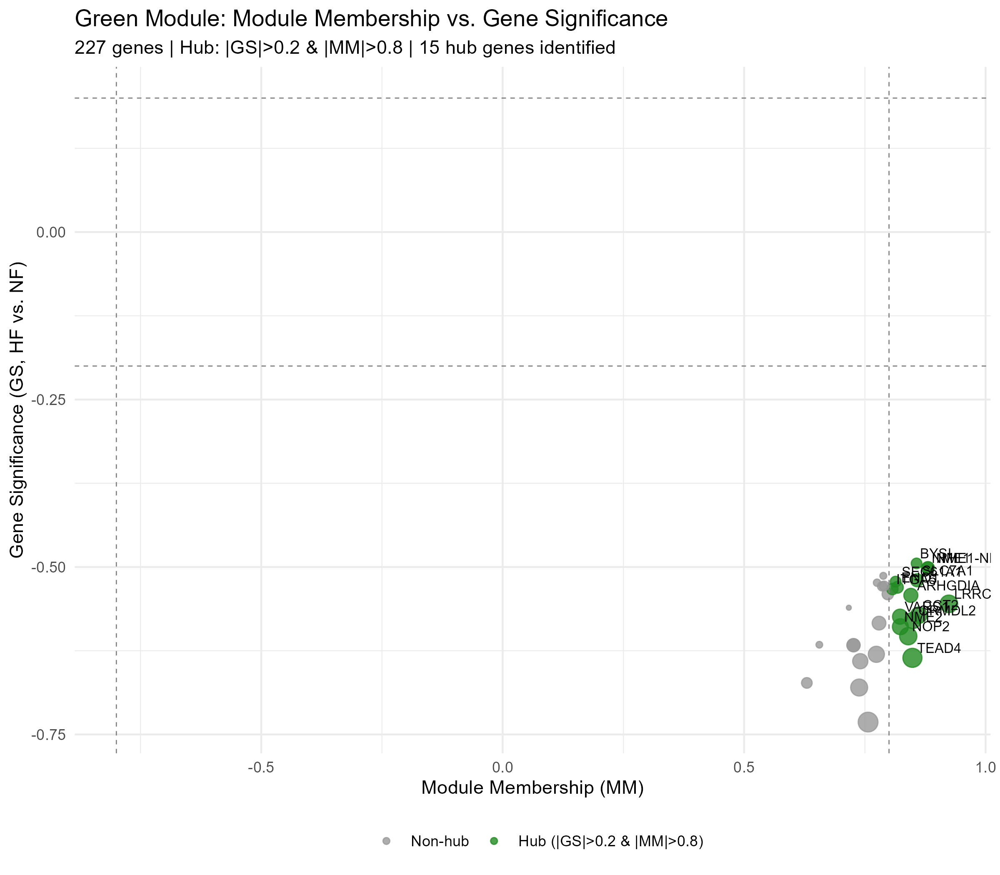
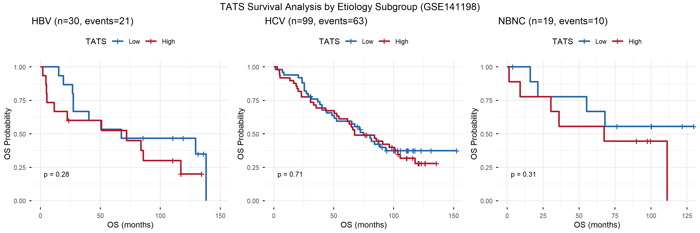
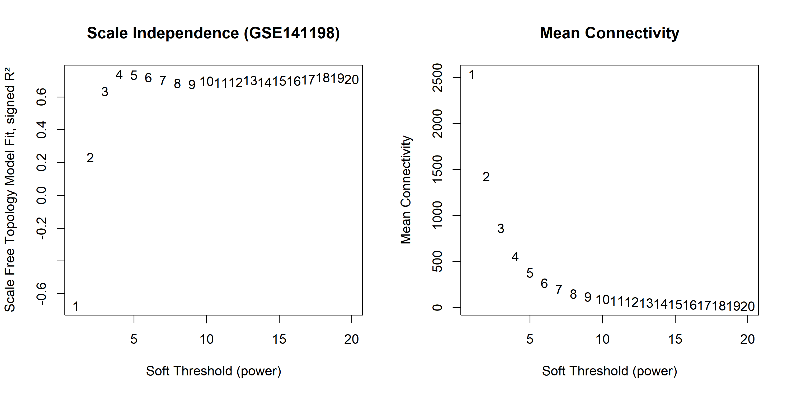
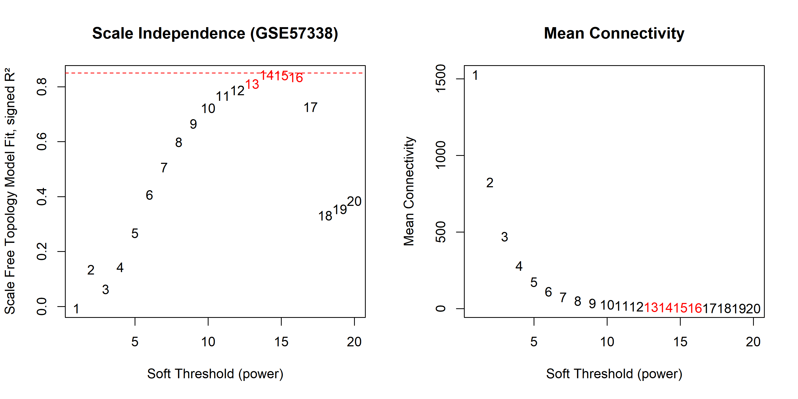
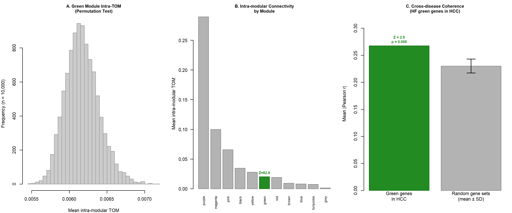

# Supplementary Information

## Distinct network organization accompanies mirror perturbation of translation-related transcriptional programs in heart failure and hepatocellular carcinoma

[Author 1], [Author 2], [Corresponding Author]

---

## Supplementary Figures

**Fig. S1. Green module hub gene identification.** Module Membership vs. Gene Significance scatter plot for 227 green module genes. Hub genes (|GS| > 0.2 and |MM| > 0.8) are highlighted in green; top 10 hub genes are labeled.

---

**Fig. S2. TATS exploratory survival analysis in GSE141198 by etiology subgroup.** Kaplan–Meier survival curves stratified by HBV, HCV, and NBNC etiology. TATS (median split) shows no significant prognostic value in any subgroup, consistent with the overall cohort analysis.

---

**Fig. S3. Soft threshold selection for WGCNA.** Scale-free topology model fit (R², left panels) and mean connectivity (right panels) as a function of soft threshold power (β). (A) GSE141198 (HCC): β = 4, signed R² = 0.84. (B) GSE57338 (HF): β = 17, signed R² = 0.865. The R² ≈ 0.85 criterion (dashed red line) was used for threshold selection.

---

**Fig. S4. Module internal robustness and cross-disease coherence assessment.** (A) Permutation histogram: mean intra-modular TOM for 10,000 random gene sets vs. green module (Z = 62.8, p < 0.0001). (B) Intra-modular connectivity by module. (C) Cross-disease gene set coherence: mean absolute pairwise correlation of green module genes in HCC (GSE141198) vs. random gene sets (Z = 2.9, p = 0.008).

---

## Supplementary Tables

**Table S1.** HF green module gene list (227 genes) with Module Membership, Gene Significance, and hub gene annotation.

**Table S2.** Complete ssGSEA pathway effect sizes (Cohen's d) for 81 pathways across HCC (TCGA-LIHC) and HF (GSE57338), with cross-disease comparison. Includes mirror direction annotation (Yes/No: whether the pathway shows HCC↑/HF↓ pattern) and pathway source (Hallmark/KEGG/Reactome).

**Table S3.** Cross-disease log2FC and FDR for translation-related module genes in HF (GSE57338) and HCC (TCGA-LIHC).

**Table S4.** Translation-related pathways showing mirror perturbation (HCC↑/HF↓) with cross-disease Cohen's d effect sizes. Includes pathway name, source database (Hallmark/KEGG/Reactome), HF and HCC effect sizes, and mirror direction annotation for all 33 translation-related pathways.

**Table S5.** GO Biological Process enrichment with fold enrichment for the HF green module (227 genes). Includes GO ID, description, GeneRatio, BgRatio, fold enrichment, p-value, adjusted p-value, and translation-related annotation for 29 significantly enriched terms.

**Table S6.** Complete TF–TATS Spearman correlation statistics for all 19 candidate transcription factors in GSE141198 (n = 148 tumors). Includes Spearman ρ, p-value, FDR (Benjamini–Hochberg correction), and significance annotation.

**Table S7.** Gene overlap analysis between TATS constituent genes (227 green module genes) and Hallmark pathway gene sets (MYC Targets V1/V2, E2F Targets, MTORC1 Signaling, G2M Checkpoint, Unfolded Protein Response, and negative controls). Includes overlap count, percentage, Jaccard index, and hypergeometric test results. Also includes de-overlap sensitivity analysis results (TF–TATS correlations before and after removal of shared genes) and bootstrap 95% confidence intervals for key Spearman correlations.
